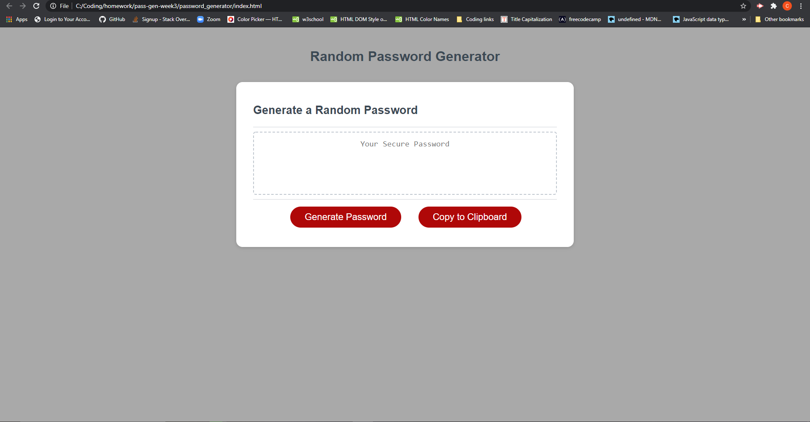
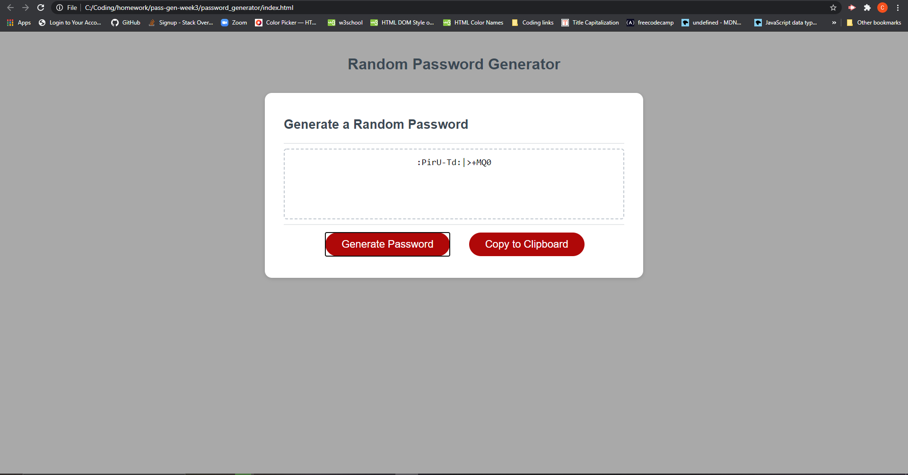

# password_generator

Hi this is my Random Password Generator. As you look at the home page you will find two buttons one saying "Generate Password" and the other saying "Copy to Clipboard". After clicking on "Generate Password" you will go through a series of prompts asking the user to set the criteria for their password. It will then generate a password using that criteria. The user can then copy their password to the computers clipboard for ease of transfer to another website or document.

Here is the link to the deployed Password Generator: https://codymichaud.github.io/password_generator/

